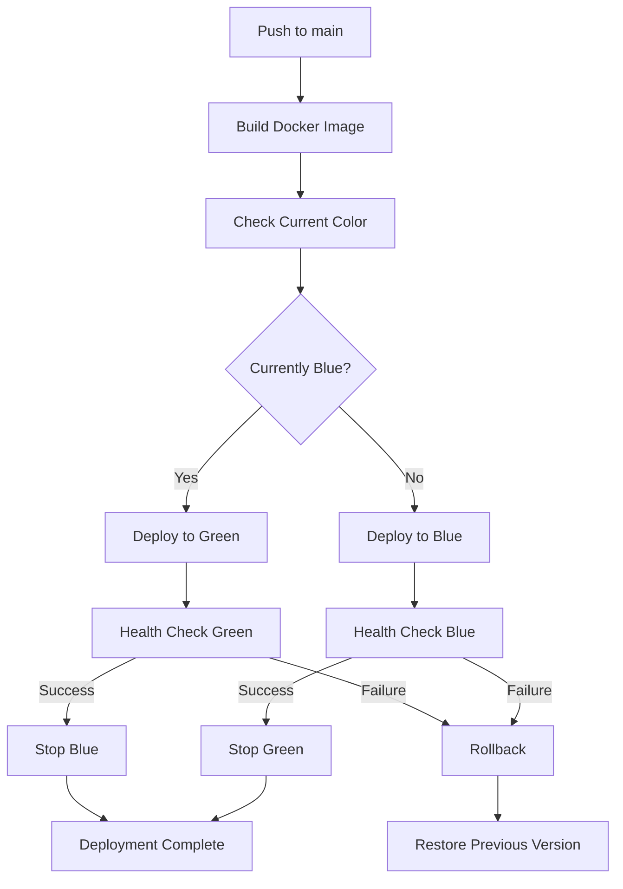

# 🐳 Docker Deployment Guide

This guide covers running the application using Docker for both local development and production deployment with zero-downtime deployments.

## Table of Contents

- [Prerequisites](#prerequisites)
- [Local Development Setup](#local-development-setup)
- [Production Deployment](#production-deployment)
- [Zero-Downtime Deployment Strategy](#zero-downtime-deployment-strategy)
- [Troubleshooting](#troubleshooting)
- [Useful Commands](#useful-commands)

---

## Prerequisites

### Required Software

- **Docker**: Version 20.10 or higher
- **Docker Compose**: Version 2.0 or higher

### Install Docker

#### macOS

```bash
# Install Docker Desktop
brew install --cask docker
# Or download from: https://www.docker.com/products/docker-desktop
```

#### Linux (Ubuntu/Debian)

```bash
# Install Docker
curl -fsSL https://get.docker.com -o get-docker.sh
sudo sh get-docker.sh

# Install Docker Compose
sudo curl -L "https://github.com/docker/compose/releases/latest/download/docker-compose-$(uname -s)-$(uname -m)" -o /usr/local/bin/docker-compose
sudo chmod +x /usr/local/bin/docker-compose

# Add user to docker group
sudo usermod -aG docker $USER
```

#### Verify Installation

```bash
docker --version
docker-compose --version
```

---

## Local Development Setup

### 1. Clone the Repository

```bash
git clone <repository-url>
cd aeo-server
```

### 2. Set Up Environment Variables

```bash
# Copy the Docker environment template
cp .env.docker.example .env

# Edit .env with your actual values
nano .env  # or use your preferred editor
```

**Important**: Update these critical values in `.env`:

- `JWT_SECRET` - Use a strong random string
- `SESSION_SECRET` - Use a strong random string
- `OPENAI_API_KEY` - Your OpenAI API key
- `COGNITO_*` - Your AWS Cognito configuration
- `STRIPE_*` - Your Stripe API keys
- `SENDGRID_*` - Your SendGrid configuration

### 3. Start the Application

```bash
# Start all services (MongoDB, Redis, App)
docker-compose up

# Or run in detached mode (background)
docker-compose up -d

# View logs
docker-compose logs -f

# View logs for specific service
docker-compose logs -f app
```

### 4. Access the Application

- **API Server**: http://localhost:5000
- **Health Check**: http://localhost:5000/health
- **MongoDB**: localhost:27017
- **Redis**: localhost:6379

### 5. Stop the Application

```bash
# Stop all services
docker-compose down

# Stop and remove volumes (WARNING: This deletes all data)
docker-compose down -v
```

---

## Production Deployment

### EC2 Instance Setup

#### 1. Install Docker on EC2

```bash
# Connect to your EC2 instance
ssh -i your-key.pem ubuntu@your-ec2-ip

# Install Docker
curl -fsSL https://get.docker.com -o get-docker.sh
sudo sh get-docker.sh

# Install Docker Compose
sudo curl -L "https://github.com/docker/compose/releases/latest/download/docker-compose-$(uname -s)-$(uname -m)" -o /usr/local/bin/docker-compose
sudo chmod +x /usr/local/bin/docker-compose

# Add ubuntu user to docker group
sudo usermod -aG docker ubuntu

# Log out and back in for group changes to take effect
exit
```

#### 2. Setup GitHub Actions Runner

```bash
# Navigate to your repository settings on GitHub
# Settings -> Actions -> Runners -> New self-hosted runner
# Follow the instructions to install and configure the runner

# Add labels: self-hosted, prod
```

#### 3. Create Production Environment File

```bash
# On your EC2 instance, create .env file
cd /home/ubuntu/actions-runner/_work/aeo-server/aeo-server
nano .env
```

**Note**: The `.env` file will be automatically created by GitHub Actions from your repository secrets.

### GitHub Secrets Configuration

Add these secrets to your GitHub repository:
**Settings → Secrets and variables → Actions → New repository secret**

```
AUTH_PROVIDER=cognito
JWT_SECRET=<your-production-jwt-secret>
JWT_EXPIRES_IN=7d
COGNITO_REGION=us-east-1
COGNITO_USER_POOL_ID=<your-pool-id>
COGNITO_APP_CLIENT_ID=<your-client-id>
COGNITO_DOMAIN=<your-domain>
OAUTH_REDIRECT_URI=https://api.yourdomain.com/api/auth/callback
OAUTH_LOGOUT_REDIRECT_URI=https://yourdomain.com
SESSION_SECRET=<your-production-session-secret>
SESSION_TTL_SECONDS=28800
COOKIE_NAME=aeo_session
GOOGLE_CLIENT_ID=<your-google-client-id>
GOOGLE_CLIENT_SECRET=<your-google-client-secret>
GOOGLE_REDIRECT_URI=https://api.yourdomain.com/api/oauth/google/callback
LINKEDIN_CLIENT_ID=<your-linkedin-client-id>
LINKEDIN_CLIENT_SECRET=<your-linkedin-client-secret>
LINKEDIN_REDIRECT_URI=https://api.yourdomain.com/api/oauth/linkedin/callback
CLIENT_URL=https://yourdomain.com
FRONTEND_URL=https://yourdomain.com
OPENAI_API_KEY=<your-openai-key>
STRIPE_SECRET_KEY=<your-stripe-secret>
STRIPE_WEBHOOK_SECRET=<your-stripe-webhook-secret>
SENDGRID_API_KEY=<your-sendgrid-key>
SENDGRID_FROM_EMAIL=noreply@yourdomain.com
SENDGRID_TEMPLATE_IDS={"welcome":"d-xxx","invite":"d-xxx","reset":"d-xxx"}
USE_MOCK_EMAIL=false
PAGESPEED_API_KEY=<your-pagespeed-key>
AWS_ACCESS_KEY_ID=<your-aws-key>
AWS_SECRET_ACCESS_KEY=<your-aws-secret>
AWS_REGION=us-east-1
```

---

## Zero-Downtime Deployment Strategy

### How It Works

The deployment uses a **Blue-Green deployment** strategy:

1. **Current State**: App running on `app-blue` container
2. **New Deployment**: Build and deploy to `app-green` container
3. **Health Check**: Wait for `app-green` to be healthy
4. **Switch**: Nginx load balancer distributes traffic to both
5. **Graceful Shutdown**: Stop `app-blue` after `app-green` is stable
6. **Next Deployment**: Deploy to `app-blue` and repeat

### Architecture

```
┌─────────────────────────────────────────────┐
│              Nginx Load Balancer            │
│            (Port 5000 → Port 80)            │
└──────────────┬─────────────┬────────────────┘
               │             │
       ┌───────▼─────┐   ┌───▼──────────┐
       │  app-blue   │   │  app-green   │
       │  (Active)   │   │  (Standby)   │
       └──────┬──────┘   └──────┬───────┘
              │                 │
              └────────┬────────┘
                       │
         ┌─────────────▼──────────────┐
         │  MongoDB + Redis (Shared)  │
         └────────────────────────────┘
```

### Deployment Flow



### Manual Deployment

```bash
# On EC2 instance
cd /path/to/aeo-server

# Deploy to production
docker-compose -f docker-compose.prod.yml up -d

# Check status
docker-compose -f docker-compose.prod.yml ps

# View logs
docker-compose -f docker-compose.prod.yml logs -f
```

---

## Troubleshooting

### Check Container Status

```bash
# List running containers
docker ps

# List all containers (including stopped)
docker ps -a

# Check specific container logs
docker logs aeo-server-blue --tail 100 -f
docker logs aeo-server-green --tail 100 -f
docker logs aeo-mongodb-prod --tail 50
docker logs aeo-redis-prod --tail 50
```

### Check Container Health

```bash
# Check health status
docker inspect aeo-server-blue | grep -A 10 Health
docker inspect aeo-server-green | grep -A 10 Health

# Manual health check
docker exec aeo-server-blue node -e "require('http').get('http://localhost:5000/health', (r) => {console.log(r.statusCode); process.exit(r.statusCode === 200 ? 0 : 1)})"
```

### Database Connection Issues

```bash
# Check MongoDB connection
docker exec -it aeo-mongodb-prod mongosh --eval "db.adminCommand('ping')"

# Check Redis connection
docker exec -it aeo-redis-prod redis-cli ping

# View MongoDB logs
docker logs aeo-mongodb-prod --tail 50
```

### Network Issues

```bash
# List networks
docker network ls

# Inspect network
docker network inspect aeo-server_aeo-network

# Test connectivity between containers
docker exec aeo-server-blue ping -c 3 mongodb
docker exec aeo-server-blue ping -c 3 redis
```

### Clean Up

```bash
# Stop all containers
docker-compose -f docker-compose.prod.yml down

# Remove all unused containers, networks, images
docker system prune -a

# Remove specific volumes (WARNING: Deletes data)
docker volume rm aeo-server_mongodb_data
docker volume rm aeo-server_redis_data
```

### Rollback Deployment

```bash
# If deployment fails, rollback to previous version
docker-compose -f docker-compose.prod.yml stop app-green
docker-compose -f docker-compose.prod.yml rm -f app-green
docker-compose -f docker-compose.prod.yml up -d app-blue

# Or use the tagged image
docker tag aeo-server:previous aeo-server:latest
docker-compose -f docker-compose.prod.yml up -d --force-recreate app-blue
```

---

## Useful Commands

### Development

```bash
# Rebuild containers after code changes
docker-compose up --build

# Rebuild specific service
docker-compose build app

# Run commands in container
docker-compose exec app npm run migrate:analysis
docker-compose exec app node scripts/validate-env.js

# Access MongoDB shell
docker-compose exec mongodb mongosh aeo-dev

# Access Redis CLI
docker-compose exec redis redis-cli

# View real-time resource usage
docker stats
```

### Production

```bash
# View all services status
docker-compose -f docker-compose.prod.yml ps

# Restart specific service
docker-compose -f docker-compose.prod.yml restart app-blue

# Scale services (if needed)
docker-compose -f docker-compose.prod.yml up -d --scale app-blue=2

# Export logs
docker-compose -f docker-compose.prod.yml logs --since 1h > logs.txt

# Backup MongoDB data
docker exec aeo-mongodb-prod mongodump --out=/data/backup
docker cp aeo-mongodb-prod:/data/backup ./mongodb-backup

# Restore MongoDB data
docker cp ./mongodb-backup aeo-mongodb-prod:/data/restore
docker exec aeo-mongodb-prod mongorestore /data/restore
```

### Monitoring

```bash
# Watch logs in real-time
docker-compose logs -f --tail 100

# Monitor specific service
docker-compose logs -f app

# Check resource usage
docker stats --no-stream

# Continuous monitoring
watch -n 2 docker-compose ps
```

---

## Security Considerations

### Production Checklist

- ✅ Use strong, random values for `JWT_SECRET` and `SESSION_SECRET`
- ✅ Enable HTTPS with SSL certificates (use nginx-proxy or AWS ALB)
- ✅ Set `USE_MOCK_EMAIL=false` in production
- ✅ Configure proper CORS origins in production
- ✅ Use environment-specific MongoDB and Redis credentials
- ✅ Enable MongoDB authentication
- ✅ Use Docker secrets for sensitive data (instead of .env)
- ✅ Regularly update Docker images
- ✅ Set up automated backups for MongoDB
- ✅ Configure proper log retention policies
- ✅ Monitor container health and resource usage

### Using Docker Secrets (Advanced)

```bash
# Create secrets
echo "super-secret-jwt-key" | docker secret create jwt_secret -
echo "super-secret-session-key" | docker secret create session_secret -

# Reference in docker-compose.yml
secrets:
  jwt_secret:
    external: true
  session_secret:
    external: true
```

---

## Performance Optimization

### Resource Limits

Edit `docker-compose.prod.yml` to add resource limits:

```yaml
services:
  app-blue:
    deploy:
      resources:
        limits:
          cpus: "1.0"
          memory: 1G
        reservations:
          cpus: "0.5"
          memory: 512M
```

### Database Tuning

```yaml
# MongoDB configuration
mongodb:
  command: mongod --wiredTigerCacheSizeGB 0.5

# Redis configuration
redis:
  command: redis-server --maxmemory 256mb --maxmemory-policy allkeys-lru
```

---

## Support

For issues or questions:

1. Check the [Troubleshooting](#troubleshooting) section
2. Review container logs: `docker-compose logs`
3. Check GitHub Actions logs for deployment issues
4. Verify environment variables are correctly set

---

## Migration from PM2 to Docker

### Comparison

| Feature          | PM2                                         | Docker                        |
| ---------------- | ------------------------------------------- | ----------------------------- |
| **Setup**        | Manual Node.js, MongoDB, Redis installation | Automated with docker-compose |
| **Isolation**    | Shared system resources                     | Containerized isolation       |
| **Dependencies** | Manual installation                         | Bundled in image              |
| **Scaling**      | PM2 cluster mode                            | Container orchestration       |
| **Deployment**   | Code pull + npm install + PM2 reload        | Image pull + container swap   |
| **Downtime**     | ~2-5 seconds                                | Zero with blue-green          |
| **Consistency**  | Depends on environment                      | Identical across environments |

### Migration Steps

1. **Test locally with Docker**: Verify everything works
2. **Set up GitHub secrets**: Add all production environment variables
3. **Update GitHub Actions workflow**: Switch from PM2 to Docker
4. **First deployment**: Will set up initial containers
5. **Verify**: Check health endpoint and logs
6. **Clean up PM2**: Stop and remove PM2 processes

```bash
# After successful Docker deployment, clean up PM2
pm2 stop aeo-server
pm2 delete aeo-server
pm2 save
```

---

## Additional Resources

- [Docker Documentation](https://docs.docker.com/)
- [Docker Compose Documentation](https://docs.docker.com/compose/)
- [Blue-Green Deployment](https://martinfowler.com/bliki/BlueGreenDeployment.html)
- [MongoDB Docker Hub](https://hub.docker.com/_/mongo)
- [Redis Docker Hub](https://hub.docker.com/_/redis)
- [Nginx Docker Hub](https://hub.docker.com/_/nginx)

---

**Last Updated**: October 2025  
**Version**: 1.0.0
